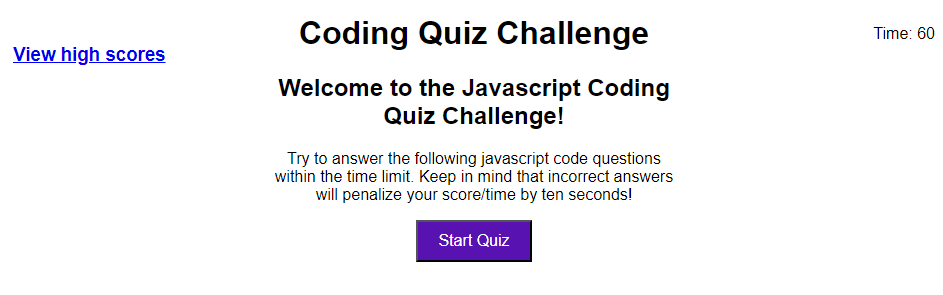

# Coding-Quiz

## Description

In this challenge, I created a timed quiz with 5 questions and feedback to the questions. At the end I also added a highscores and the results for the person to see.

## Installation

I used visual studio code to create this code in a script.js file, index.html file, and a style.css file.

## Usage

Link to the deployed application: 

https://stevea28.github.io/Coding-Quiz/

## Credits

N/A

## License 

Please refer to the LICENSE in the repo.
